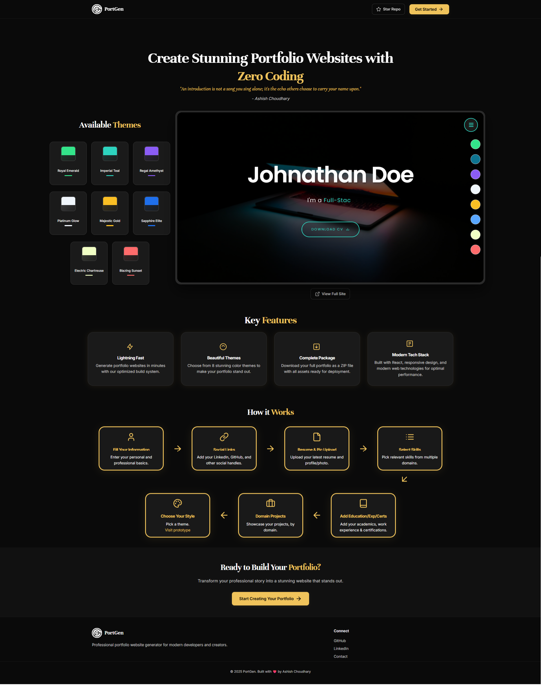
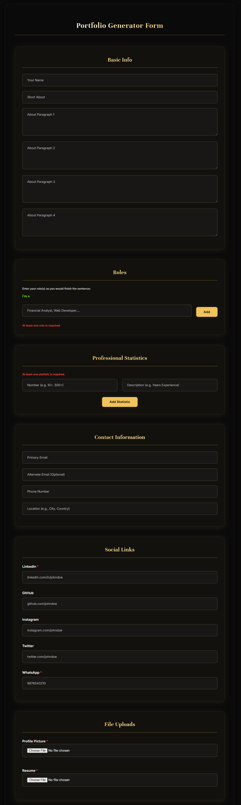
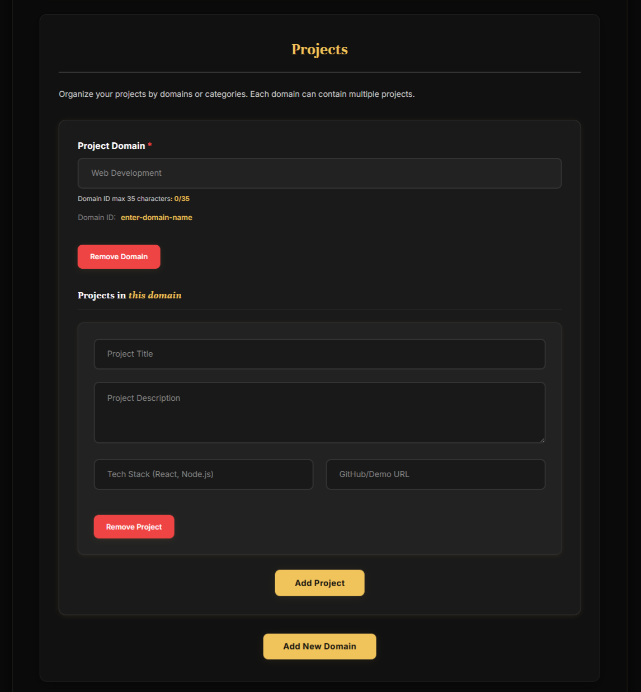
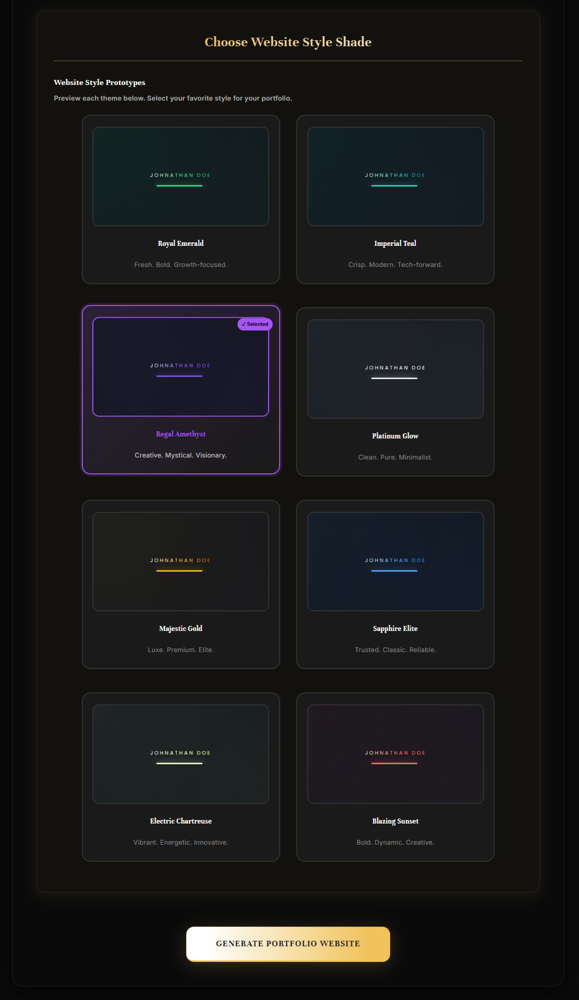

# PortGen - The Dynamic Portfolio Generator

A modern, dynamic portfolio generator that creates personalized portfolio websites with customizable content, animations, and responsive design. Built with React frontend form for data collection and Spring Boot backend for portfolio generation.

## Features

#### Frontend Form Interface (React)
- **Data Collection Form**: Personal information, skills, projects, education, and certifications
- **Interactive UI**: Real-time validation, progress indicators, localStorage persistence
- **Theme Selection**: 8 professional color themes with live preview
- **Responsive Design**: Optimized for all devices with dark mode interface

#### Backend Services (Spring Boot)
- **Portfolio Generation Engine**: Template-based React portfolio creation with dynamic content injection
- **Asset Management**: Icon repository and resource bundling system
- **ZIP Generation**: Complete portfolio structure with cross-platform compatibility

#### Generated Portfolio Output
- **Complete React Application**: Hero section, skills showcase, projects gallery, education timeline
- **Professional Design**: Modern themes, responsive layout, SEO-optimized structure
- **Real-time Theme Switching**: Dynamic color customization in generated portfolios

## UML Diagram

*UML diagram to understand the workflow of the project

## User Journey & Experience

### Landing Page Experience
Navigate to `http://localhost:3000` to access the professional landing page featuring inspirational content, interactive demo preview, and clear call-to-action buttons.


*Professional landing page with hero section, theme showcase, and navigation options*

### Portfolio Generation Workflow

#### Step 1: Personal Information Collection
Click "Start Building Now" to access the form at `http://localhost:3000/generator`. The intelligent **localStorage persistence** automatically saves your progress.


*Comprehensive personal details form with auto-save functionality*

#### Step 2: Skills & Technologies Selection
Choose from categorized technology stacks with proficiency indicators and custom skill additions.


*Interactive skills selection with technology categories and proficiency levels*

#### Step 3: Education & Experience Documentation
Input academic background, work experience, and professional certifications in a streamlined interface.


*Education, work experience, and certifications input sections*

#### Step 4: Projects Portfolio Showcase
Add project details, technology stacks, descriptions, and live demo links.


*Project details input with technology stack and link management*

#### Step 5: Theme Customization
Select from 8 professionally designed color themes to match your personal brand.


*Professional theme selection with real-time preview options*

#### Step 6: Generated Portfolio Output
The system generates a complete, production-ready React application. View live demo with real-time theme switching at: **https://portgen-prototype.netlify.app/**

*Visit the live demo to see the professional quality and dynamic theme switching capabilities of generated portfolios*

### System Architecture

#### High-Level Architecture Overview

```
┌─────────────────────┐                    ┌─────────────────────┐
│   Landing Page      │    Navigation      │   Form Generator    │
│   (localhost:3000)  │ ─────────────────► │   (/generator)      │
│                     │                    │                     │
│ • Hero Section      │                    │ • Multi-step Form   │
│ • Theme Preview     │                    │ • localStorage      │
│ • Live Demo Link    │                    │ • Real-time Valid.  │
│ • Call-to-Action    │                    │ • Progress Tracking │
└─────────────────────┘                    └─────────────────────┘
                                                      │
                                                      │ Form Data
                                                      ▼
                                           ┌─────────────────────┐
                                           │   pg-backend/       │
                                           │                     │
                                           │ • Template Engine   │
                                           │ • Asset Management  │
                                           │ • ZIP Generation    │
                                           │ • API Processing    │
                                           └─────────────────────┘
                                                      │
                                                      ▼
                                           ┌─────────────────────┐
                                           │   Generated ZIP     │
                                           │                     │
                                           │ Complete Portfolio  │
                                           │ • React Application │
                                           │ • Theme System      │
                                           │ • Production Ready  │
                                           └─────────────────────┘
```

#### Container Architecture (Docker)

```
Docker Environment
├─────────────────────────────────────────────────────────────────────┐
│                                                                     │
│  ┌─────────────────────────┐      ┌─────────────────────────────┐   │
│  │    Frontend Container   │      │     Backend Container       │   │
│  │   (pg-frontend)         │      │      (pg-backend)           │   │
│  │                         │      │                             │   │
│  │ • Node.js 22-alpine     │◄────►│ • OpenJDK 21-jdk-slim       │   │
│  │ • React App (Port 3000) │      │ • Spring Boot (Port 8080)   │   │
│  │ • Landing Page          │      │ • Maven Build               │   │
│  │ • Form Generator        │      │ • Template Engine           │   │
│  │ • State Management      │      │ • ZIP Generation            │   │
│  └─────────────────────────┘      └─────────────────────────────┘   │
│              │                                    │                 │
│              └────────────────────────────────────┘                 │
│                        Docker Network                               │
│                     (portgen-network)                               │
└─────────────────────────────────────────────────────────────────────┘

External Access:
• Frontend: http://localhost:3000
• Backend API: http://localhost:8080
```

## Prerequisites

- **Docker and Docker Compose** (for containerized deployment)
- **Node.js 22+** (for local development)
- **Java 21+** (for local backend development)
- **Maven** (for backend build)

## Quick Start with Docker

### 1. Clone the repository
```bash
git clone https://github.com/Ashish110411/PortGen.git
cd PortGen
```

### 2. Build backend service
```bash
cd pg-backend
mvn compile jib:dockerBuild
```

### 3. Build frontend service
```bash
cd ../pg-frontend
docker build --no-cache -t ashish110411/portgen-frontend .
```

### 4. Start all services
```bash
cd ..
docker-compose up -d
```

### 5. Access the application
- **Landing Page**: http://localhost:3000
- **Portfolio Generator**: http://localhost:3000/generator
- **Backend API**: http://localhost:8080

## Alternative Setup

Use docker-compose for complete build process:

```bash
docker-compose up --build -d
```

## API Documentation

### Portfolio Generation Endpoint
- `POST /api/portfolio/generate` - Generate complete portfolio ZIP file
- **Response**: ZIP file containing production-ready React portfolio application

## Development Setup

### Frontend Development
```bash
cd pg-frontend
npm install
npm start
```

### Backend Development
```bash
cd pg-backend
mvn spring-boot:run
```

## Key Features

### Smart Form System
- **localStorage Persistence**: Auto-save functionality prevents data loss
- **Real-time Validation**: Immediate feedback on input requirements
- **Multi-step Progress**: Visual indicators for completion tracking
- **Reset Capability**: Clear all data with single button action

### Professional Output
- **8 Premium Themes**: Carefully designed color schemes
- **Dynamic Theme Switching**: Real-time customization in generated portfolios
- **SEO Optimization**: Production-ready structure and meta tags
- **Responsive Design**: Mobile-first approach for all devices

### Template System
- **Component-based Architecture**: Modular React components
- **Asset Management**: Automated icon and image integration
- **Cross-platform Compatibility**: Works across all hosting platforms

## Contributing

1. Fork the repository
2. Create a feature branch (`git checkout -b feature/amazing-feature`)
3. Commit your changes (`git commit -m 'Add some amazing feature'`)
4. Push to the branch (`git push origin feature/amazing-feature`)
5. Open a Pull Request

## License

This project is licensed under the MIT License - see the LICENSE file for details.

## Support

For support and questions:
- 📧 Email: ashishchaudhary110411@gmail.com
- 🐛 Issues: [GitHub Issues](https://github.com/Ashish110411/PortGen/issues)
- 🌐 Live Demo: [Portfolio Sample](https://portgen-prototype.netlify.app/)

---

**Version**: 1.7.0  
Built with ❤️ by [Ashish110411](https://github.com/Ashish110411)
